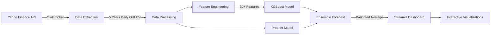

<p align="center">
  
</p>

<h1 align="center">🪙 Silver Price Forecaster</h1>

<p align="center">
  <strong>AI-Powered Silver Futures Price Prediction Engine</strong><br/>
  <em>Built with Prophet, XGBoost & Streamlit</em>
</p>

<p align="center">
  <a href="https://www.python.org/downloads/release/python-3130/">
    
  </a>
  <a href="https://streamlit.io/">
    
  </a>
  <a href="https://facebook.github.io/prophet/">
    
  </a>
  <a href="https://xgboost.readthedocs.io/">
    
  </a>
  <a href="https://github.com/RagadAhmed/silver_price/blob/main/LICENSE">
    
  </a>
</p>

<p align="center">
  <a href="#-features">Features</a> •
  <a href="#-demo">Demo</a> •
  <a href="#-quick-start">Quick Start</a> •
  <a href="#-architecture">Architecture</a> •
  <a href="#-models">Models</a> •
  <a href="#-contributing">Contributing</a>
</p>

---

## 📌 Overview

**Silver Price Forecaster** is a production-grade, AI-powered web application that extracts **5 years** of historical silver futures (SI=F) data from **Yahoo Finance**, performs comprehensive time-series analysis, and generates **1-year ahead price forecasts** using an ensemble of **Facebook Prophet** and **XGBoost** models — all wrapped in a sleek, interactive Streamlit dashboard.

> 💡 *Designed for data scientists, traders, and financial analysts who need reliable, low-RMSE silver price predictions with full transparency into model performance.*

---

## ✨ Features

### 📈 Historical Analysis
- **Interactive Candlestick Chart** with 50-day and 200-day moving averages
- **Trading Volume Visualization** with color-coded buy/sell pressure
- **Daily Return Distribution** histogram with statistical overlay
- **Monthly Return Heatmap** — spot seasonal patterns at a glance

### 🔮 AI-Powered Forecasting
- **Facebook Prophet** — captures trends, weekly/monthly/quarterly/yearly seasonality
- **XGBoost Regressor** — leverages 30+ engineered features (lags, rolling stats, EMAs, momentum)
- **Ensemble Model** — weighted combination for robust, low-RMSE predictions
- **95% Confidence Intervals** — understand prediction uncertainty

### 🏆 Model Performance Dashboard
- Side-by-side **RMSE, MAE, R² Score** comparison
- **Actual vs. Predicted** validation charts
- **Feature Importance** ranking (Top 15 XGBoost features)
- Real-time model selection: **best model auto-highlighted**

### 📋 Data Explorer
- **Descriptive Statistics** for all price columns
- **Yearly Performance** table with return percentages
- **Raw Data Browser** with the latest 100 records
- **CSV Export** — download the full dataset with one click

### 🎛️ Interactive Controls
- **Forecast Horizon Slider** — adjust from 30 to 365 days
- **Model Weight Slider** — fine-tune Prophet vs. XGBoost blend
- **Refresh Data** — pull the latest prices from Yahoo Finance

---

## 🚀 Quick Start

### Prerequisites

- **Python 3.10+** installed on your system
- **Git** for cloning the repository
- Internet connection (to fetch data from Yahoo Finance)

### Installation

```bash
# 1. Clone the repository
git clone https://github.com/RagadAhmed/silver_price.git
cd silver_price

# 2. Create & activate a virtual environment
python -m venv venv

# Windows
.\venv\Scripts\activate

# macOS / Linux
source venv/bin/activate

# 3. Install dependencies
pip install -r requirements.txt

# 4. Launch the application
streamlit run app.py
```

The app will open automatically at **http://localhost:8501** 🎉

---

## 🏗️ Architecture

```
silver_price/
├── app.py               # Main Streamlit application
├── requirements.txt     # Python dependencies
├── .gitignore           # Git ignore rules
└── README.md            # Project documentation
```

### Data Pipeline



---

## 🧠 Models

### 1. Facebook Prophet

| Parameter | Value |
|---|---|
| Seasonality Mode | Multiplicative |
| Weekly Seasonality | ✅ Enabled |
| Yearly Seasonality | ✅ Enabled |
| Monthly Seasonality | Custom (Fourier order 5) |
| Quarterly Seasonality | Custom (Fourier order 3) |
| Changepoint Prior Scale | 0.05 |
| Number of Changepoints | 30 |

### 2. XGBoost Regressor

| Parameter | Value |
|---|---|
| Estimators | 500 |
| Max Depth | 6 |
| Learning Rate | 0.03 |
| Subsample | 0.8 |
| Column Sample by Tree | 0.8 |
| Min Child Weight | 5 |
| L1 Regularization (α) | 0.1 |
| L2 Regularization (λ) | 1.0 |

### 3. Engineered Features (XGBoost)

| Feature Category | Details |
|---|---|
| **Temporal** | Day of week, month, quarter, year, day of year, week of year |
| **Lag Features** | 1, 3, 5, 7, 14, 21, 30, 60, 90 day lags |
| **Rolling Statistics** | 7, 14, 30, 60, 90 day mean & std |
| **Exponential MA** | 7, 21, 50 span EMAs |
| **Momentum** | 7, 14, 30 day price momentum |
| **Volatility** | 30-day rolling coefficient of variation |

### 4. Ensemble Strategy

```
Prediction = (w₁ × Prophet) + (w₂ × XGBoost)
```

Default weights: `w₁ = 0.40`, `w₂ = 0.60` (adjustable via sidebar slider)

---

## 📊 Performance Metrics

The models are evaluated on a **80/20 train-validation split** using the following metrics:

| Metric | Description |
|---|---|
| **RMSE** | Root Mean Squared Error — penalizes large errors |
| **MAE** | Mean Absolute Error — average prediction error |
| **R² Score** | Coefficient of determination — variance explained |

> ⚡ The best-performing model is automatically highlighted in the dashboard.

---

## 🛠️ Tech Stack

<table>
  <tr>
    <td align="center" width="96">
      
      <br><strong>Python</strong>
    </td>
    <td align="center" width="96">
      
      <br><strong>Streamlit</strong>
    </td>
    <td align="center" width="96">
      
      <br><strong>Pandas</strong>
    </td>
    <td align="center" width="96">
      
      <br><strong>NumPy</strong>
    </td>
    <td align="center" width="96">
      
      <br><strong>Plotly</strong>
    </td>
  </tr>
  <tr>
    <td align="center" width="96">
      
      <br><strong>Scikit-learn</strong>
    </td>
    <td align="center" width="96">
      
      <br><strong>Prophet</strong>
    </td>
    <td align="center" width="96">
      
      <br><strong>XGBoost</strong>
    </td>
    <td align="center" width="96">
      
      <br><strong>yfinance</strong>
    </td>
    <td align="center" width="96">
      
      <br><strong>Git</strong>
    </td>
  </tr>
</table>

---

## 📂 Key Dependencies

```
streamlit>=1.55
yfinance>=1.2
pandas>=2.3
numpy>=2.4
scikit-learn>=1.8
prophet>=1.3
xgboost>=3.2
plotly>=6.6
statsmodels>=0.14
```

---

## 🔧 Configuration

The application can be configured through the **sidebar controls** at runtime:

| Control | Range | Default | Description |
|---|---|---|---|
| Forecast Horizon | 30–365 days | 365 | How far ahead to predict |
| Prophet Weight | 0.0–1.0 | 0.40 | Weight of Prophet in ensemble |
| XGBoost Weight | Auto | 0.60 | Complement of Prophet weight |

---

## ⚠️ Disclaimer

> **This application is for educational and research purposes only.** It does not constitute financial advice, investment recommendations, or trading signals. Past performance does not guarantee future results. Silver prices are influenced by numerous macroeconomic factors that statistical models cannot fully capture. Always consult a qualified financial advisor before making investment decisions.

---

## 🤝 Contributing

Contributions are welcome! Here's how you can help:

1. **Fork** the repository
2. **Create** a feature branch (`git checkout -b feature/amazing-feature`)
3. **Commit** your changes (`git commit -m 'Add amazing feature'`)
4. **Push** to the branch (`git push origin feature/amazing-feature`)
5. **Open** a Pull Request

### Ideas for Contributions
- [ ] Add LSTM / Transformer-based models
- [ ] Implement real-time price streaming via WebSockets
- [ ] Add sentiment analysis from financial news
- [ ] Deploy to Streamlit Cloud / AWS / GCP
- [ ] Add multi-commodity support (Gold, Platinum, Copper)
- [ ] Integrate technical indicators (RSI, MACD, Bollinger Bands)

---

## 📄 License

This project is licensed under the **MIT License** — see the [LICENSE](LICENSE) file for details.

---

## 👤 Author

<p>
  <strong>Ragad Ahmed</strong><br/>
  <a href="https://github.com/RagadAhmed">
    
  </a>
</p>

---

<p align="center">
  <sub>⭐ If you found this project useful, please consider giving it a star!</sub>
</p>

<p align="center">
  
  
</p>
